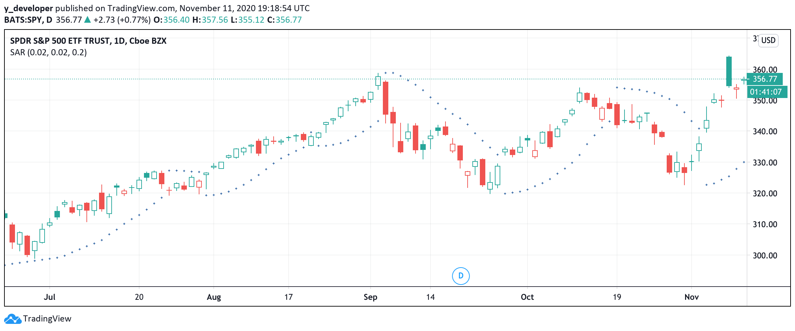
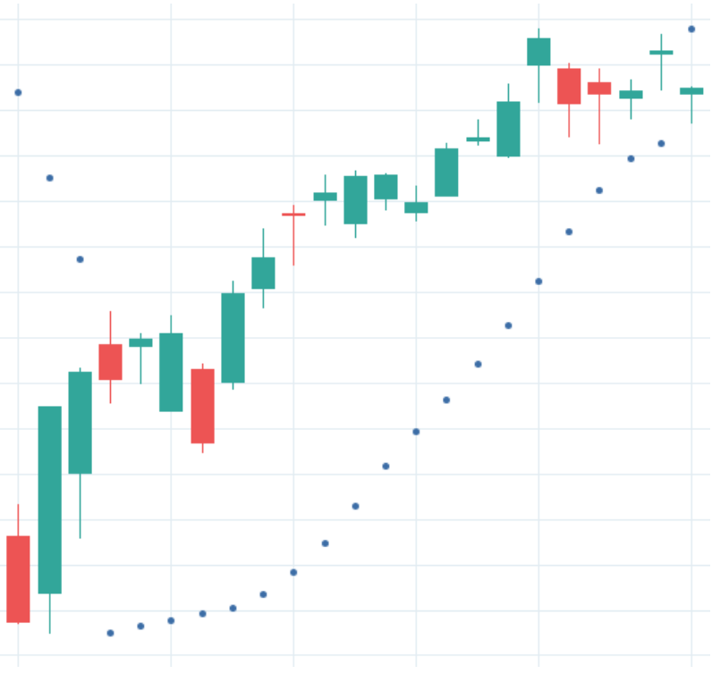
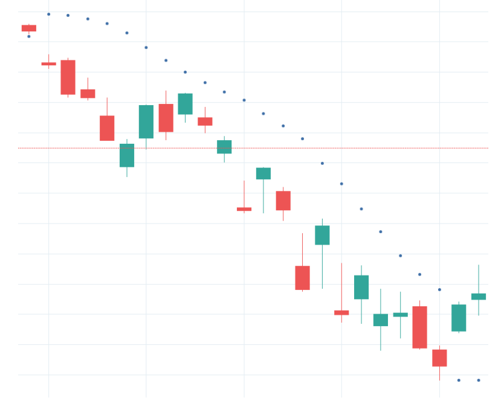
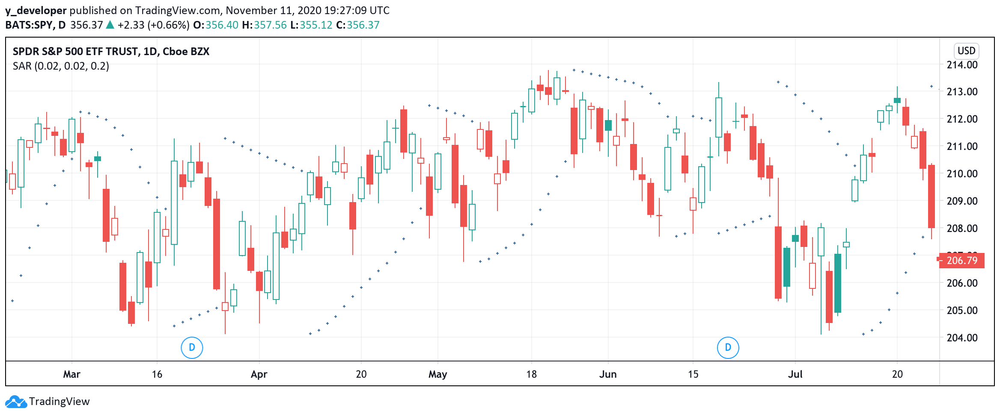
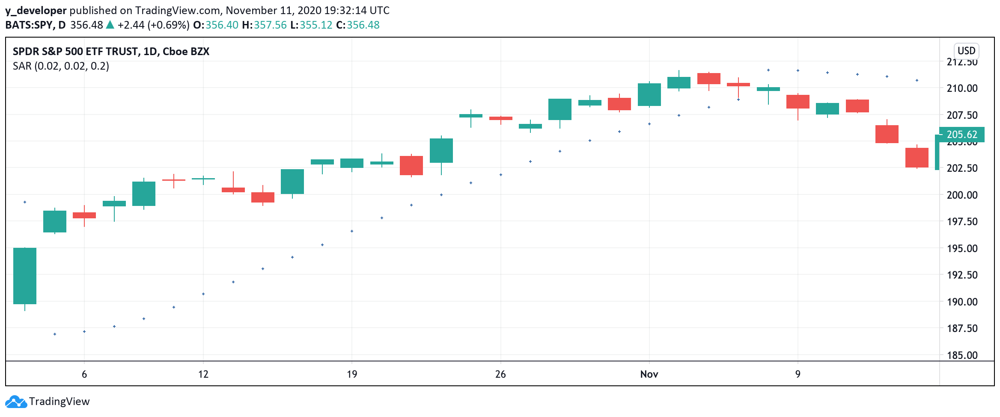

## 1. What is the SAR?

### SAR Formula

    SAR(Tn)=SAR(Tn-1)+AF(Tn)*[EP(Tn-1)-SAR(Tn-1)]
    SAR(Tn) = Current SAR
    SAR(Tn-1) = Previous SAR
    AF(Acceleration Factor) = Default is 0.02. 
    Each time EP changes, AF increases by 0.02 up to maximum acceleration 0.2

The SAR indicator, developed by J. Welles Wilder Jr., is used by traders to determine trend direction and potential reversals in price.

The technical indicator uses a trailing stop and reverse method called "SAR," or stop and reverse, to identify suitable exit and entry points. 

Each day’s SAR value is calculated based on previous day’s SAR value, a preset acceleration factor, and the day’s extreme price.

We set the acceleration factor by ourselves. The most popular initial factor is 0.02, and the most popular maximum is 0.2

When we observe a change in extreme price, we increase the factor by a preset amount, which is 0.02 by default, until the factor reaches the maximum value we give it, which is 0.2 in this case.

In other words, if we see there’s a persisting price trend, we keep increasing the acceleration factor until it reaches maximum or the trend stops.

On the other hand, extreme price is either the day’s highest or lowest price. If we observe a bullish price trend, we use highest price as extreme price; if we see a bearish one, we use lowest price.

After determining the day’s acceleration factor and extreme price, we can calculate the day’s SAR value by adding previous day’s SAR value to the product of the day’s acceleration factor and the difference between the day’s extreme price and previous day’s SAR value.

As we can see, SAR is closely connected to the price trend, as it affects both acceleration factor and extreme price.

The parabolic SAR indicator appears on a chart as a series of dots, either above or below an asset's price, depending on the direction the price is moving.

A dot is placed below the price when it is trending upward, and above the price when it is trending downward.

## 2. What does the SAR tell you?

### · Uptrend / Downtrend

When the dots are below the close price curve, there must be a uptrend in stock price.

    

On the other hand, when the dots are above the close price curve, there must be a downtrend in price

Thus, when we see the SAR dots moves across the price curve, either from above or below, we know there’s going to be a reversal in current price trend, and we should be ready to buy or sell the stock

### · Whipsaws during trendless markets

However, SAR may be a little inefficient when there’s no obvious trend going on.

In this case, we’ll see the SAR dots cross price curve frequently

If we still follow the turning points and make transactions, we may lose money due to the fact that we are trading too frequently

Thus, it’s better to combine SAR indicator with other indicators to maximize the strategy’s performance

## 3. Stop And Reverse Strategy

### · Uptrend / Downtrend Strategy

Let’s begin with the simplest SAR strategy. That is, how we decide when to buy and sell based on SAR indicator solely.

As previously discussed, SAR dots lying above price curve indicates a bearish trend, which means the price is dropping.

On the other hand, when SAR dots lying below price curve there’s a bullish trend.

Thus, if we see the SAR dots moving across price curve from above to below, we know the bearish trend has turned into a bullish one, which means the currently decreasing price will soon be increasing, and we should buy the stock.

Oppositely, when we see the SAR dots moving from below to above, the bullish trend has turned into a bearish one, and the price will drop soon. We should sell our stock as soon as possible.

## 4. Tradingview Pine Script

### · Step One: Initial Setting

    //version = 4
    strategy("Yaonology KDJ Indicators Tutorial", overlay=false,
    default_qty_type = strategy.percent_of_equity, default_qty_value = 100,
    currency = currency.USD, initial_capital = 10000,
    commission_type = strategy.commission.percent, commission_value = 0)

(1) Step one initial setting is the step we set up the strategy property, which includes “Strategy ID”, “The plot overlays the main chart or show on the separate chart pane. ”, “How much is the initial capital”, “How many percentages of capital buying the equity?”, “How much is commission fee”

(2) First, we need to set up the Pine Script version. Here, we are using the last version, version four.

(3) Then, we start to code the strategy property. The double quote we type “Yaonology SAR IndicatorsTutorial”, which is the strategy id.

(4) “overlay equals false” means that the plot will show on the separate chart pane.

(5) Then, we set up the initial capital, here, we code “initial_capital equals 10000” and “currency = currency.USD”, which means that we are using US$10000 as the initial capital

(6) Then, we need to determine how many shares we trade equities. Here, we code “default_qty_type equals strategy.percent_of_equity” and “default_qty_value equals a hundred”, which means that we are using the percentage type to trade the equity, and we use 100 percent of capital to trade the equities.

(7) Finally, we set up the commission fee. Here, we code “commision_type equals strategy.commission.percent” and “commission_value = 0”, which means that we use the percentage type to calculate the commission fee, and here we set up 0% commission fee because most brokers don’t charge the commission fee currently.

### · Step Two: Parameter Setting

    //Step Two: Parameter Setting
    s = sar(0.02, 0.02, 0.2)

(1) TradingView offers users some built-in indicator functions that can be used directly with customizable parameters.

(2) Luckily, we can use the built-in sar function to get the SAR indicator value.

(3) The function contains three parameters: the initial acceleration factor, the increment of the factor, and the maximum acceleration factor.

(4) Here, we are using the default values, which are 0.02, 0.02 and 0.2 respectively as discussed before.

(5) Finally, we store the SAR value in a variable called s.

### · Step Three: Plotting

    //Step Three: Plotting
    plot(s, style = plot.style_circles, linewidth = 2)
   
(1) Now, we plot the SAR indicator

(2) Here we are adding some extra customizations to the plot

(3) First, we can choose the shape of the line by using the style equals parameter. There are many shapes we can use, and here we want our SAR indicator to be plotted in circles

(4) Next, we fix the line width of our plot to 2. The higher the width, the bolder the line looks

### · Step Four: Strategy Entry and Strategy Close

#### i). SAR Strategy

    //Step Four: Strategy Entry and Strategy Close
    if crossover(close, s)
        strategy.entry("sar", long = true)
        
    if crossunder(close, s)
        strategy.close("sar")
        
(1) In previous section, we said that we should buy the stock when observing the day’s SAR line crosses closing price line from below, and sell the stock when it crosses from above.

(2) Here, we use two functions, crossover and crossunder to check if the above conditions are met.

(3) Crossover function returns a true or false value, which means it can be used in an if statement. Crossover brackets close comma s means we are checking if yesterday’s SAR value is lower than yesterday’s closing price, but today’s SAR value is higher than today’s closing price.

(4) If so, we buy the stock.

(5) Crossunder function is opposite to crossover. It checks whether yesterday’s SAR is higher than yesterday’s closing price but today’s SAR is lower than today’s closing price.

(6) If so, we sell the stock.

|  | **Net Profit** | **Precent Profitable** | **Profit Factor** | **Max Drawdown** | 
| --- | --- | ---| --- | --- |
| **SAR Strategy** | 33.66% | 45.03% | 1.073 | 48.9% |

#### ii). SAR against Market

|  | **Net Profit** | **Precent Profitable** | **Profit Factor** | **Max Drawdown** | 
| --- | --- | ---| --- | --- |
| **SAR Strategy** | 33.66% | 45.03% | 1.073 | 48.9% |
| **SAR against Market** | 397.95% | 70.85% | 1.474 | 35.66% |

